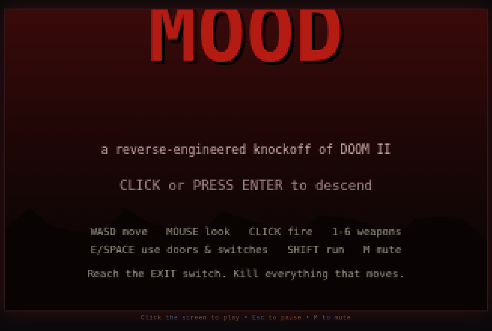
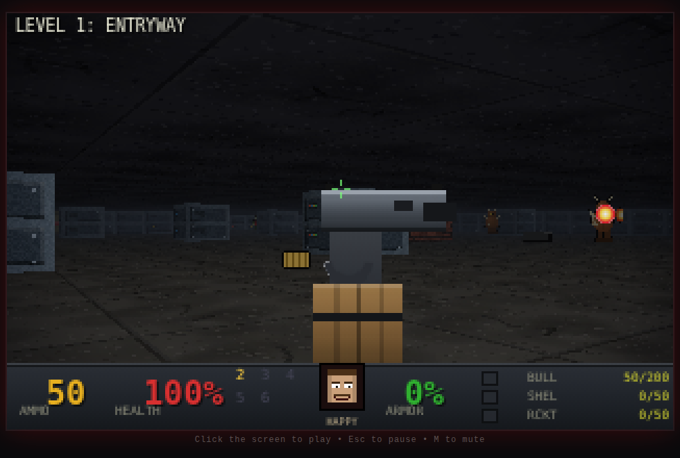
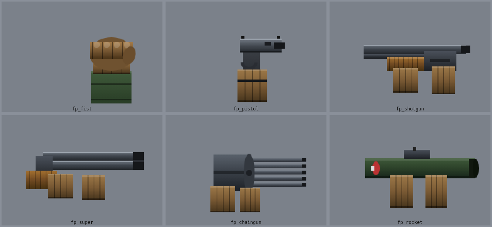
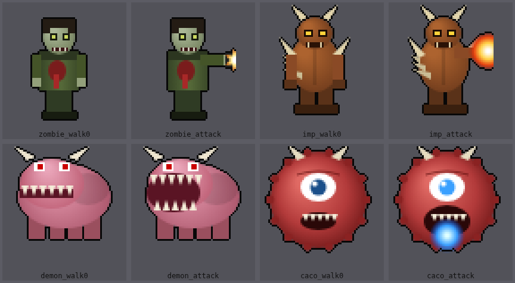
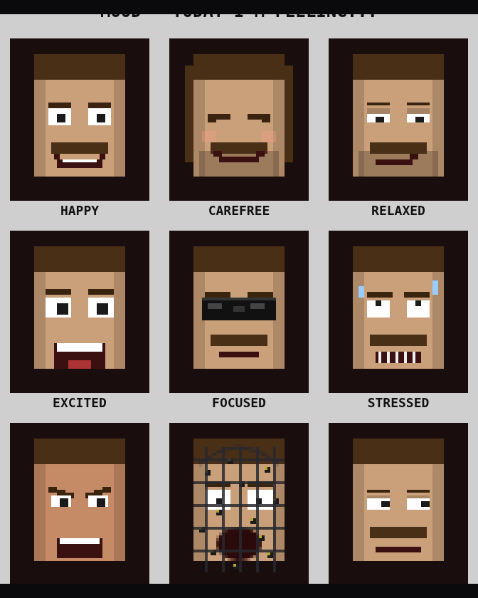

# MOOD

**A reverse-engineered knockoff of Doom II — built from scratch in a browser.**

MOOD is a self-contained, dependency-free first-person shooter in the spirit of
*Doom II: Hell on Earth*. It runs in any modern browser using a hand-written
**software raycasting renderer** (no WebGL, no game engine, no build step).
Every texture, sprite, sound, and level is **generated procedurally at runtime**
— there are no Doom assets in this repo. It's an homage, not a copy.




---

## Play it

No install, no build. You just need a static file server (ES modules can't load
over `file://`). With Node installed:

```bash
npm start            # serves on http://localhost:8080
# or:  node server.mjs
# or any static server, e.g.  python3 -m http.server 8080
```

Then open **http://localhost:8080** and click the screen.

## Controls

| Action            | Keys                                  |
| ----------------- | ------------------------------------- |
| Move              | `W` `A` `S` `D` / arrow keys          |
| Look              | Mouse (click to capture) / `←` `→`    |
| Fire              | Left mouse / `Ctrl`                   |
| Use door / switch | `E` / `Space` / `F`                   |
| Run               | `Shift`                               |
| Select weapon     | `1`–`6` (`Q` cycles)                  |
| Automap           | `Tab`                                 |
| Pause             | `Esc`                                 |
| Mute              | `M`                                   |

**Goal:** clear the level and reach the **EXIT** switch. Some doors are locked —
find the matching keycard.

---

## Features

- **Raycasting engine** rendering at a chunky 320×200 internal buffer, scaled up
  with crisp nearest-neighbour pixels. Textured walls, per-row floor/ceiling
  casting, and a depth buffer so sprites clip correctly behind walls.
- **Atmosphere:** diminishing distance lighting plus a distance **fog** that
  fades the world toward each level's mood colour, a screen **vignette**, and a
  baked dark **outline** on every monster and pickup so they read against the
  gloom. All hand-drawn procedurally — shaded weapons, volume-lit demons,
  panelled tech walls with blinking status lights, cracked grimy floors.

  
  
- **Wolfenstein-style sliding doors** computed as a mid-cell plane intersection
  during the DDA — they slide, block sight/bullets when closed, and re-open if
  something is standing in the doorway.
- **Six weapons:** fist, pistol, shotgun, super shotgun, chaingun, rocket
  launcher — hitscan with pellet spread, plus splash-damage projectiles.
- **Four enemy types** with a real AI state machine (idle → chase → attack →
  pain → death): the Former Human (hitscan), Imp (fireballs), Demon (melee
  charger), and Cacodemon (floating plasma lobber).
- **Physics & feel:** momentum-based movement (acceleration, friction, and
  velocity bleed-off when you hit a wall) and **knockback** — bullets nudge,
  fireballs shove, rockets and barrels launch both monsters and the player.
- **Emergent behaviors:** **infighting** (a monster caught in another's
  crossfire turns on it — `target` retargeting), **alerting** (gunfire and a
  monster spotting you rouse nearby sleepers), and monsters that **shove
  unlocked doors open** to chase you through.
- **Directional monster sprites:** while walking, each monster shows a front,
  side, or back view based on its facing — you see them turn and flee.
- **Automap** (`Tab`): a top-down overlay of the level with the player, doors,
  the exit, monsters, items, and barrels.
- **Pickups:** stimpacks, medikits, health/armor bonuses, MegaArmor, MegaSphere,
  ammo of every type, weapons, and three colored keycards.
- **Explosive barrels** with chain-reaction splash damage.
- **Classic status-bar HUD:** ammo, health, the ARMS panel, armor, keys, and
  per-type ammo counts — plus a live mug shot.
- **The "Today I'm Feeling..." face:** the status-bar portrait cycles through
  nine Nicolas-Cage-meme moods wired to what's actually happening —
  **HAPPY** (idle & fine), **CAREFREE** (full health, no threats),
  **RELAXED** (calm), **EXCITED** (firing / a kill), **FOCUSED** (sunglasses on
  when a monster is stalking you), **STRESSED** (taking hits), **ANGRY** (a 3+
  kill streak / fighting while wounded), **MEH** (bored), and **BEES!!!** — full
  panic, complete with a wire cage and a swarm, when you're nearly dead.

  
- **Two hand-authored levels** with a title screen, level-complete intermission
  (with kill tally), death/respawn, and a final victory screen.
- **Procedurally synthesized audio** (WebAudio) for every weapon, monster, door,
  pickup, and a looping bassline — zero audio files.

## Project layout

```
index.html          page shell
styles.css          page chrome
server.mjs          tiny zero-dependency static server
src/
  main.js           bootstrap, input wiring, frame loop, render dispatch
  raycaster.js      the software renderer (walls / floors / sprites)
  game.js           world state: player, movement, combat, AI, doors, flow
  assets.js         procedural textures, sprites, weapons, faces
  audio.js          WebAudio sound + music synthesis
  input.js          keyboard + mouse + pointer lock
  hud.js            status bar, weapon view, screen overlays
  math.js           small math/color helpers
  data/
    levels.js       ASCII level maps + parser
    enemies.js      monster stats + animation frames
    weapons.js      the arsenal
    items.js        pickups
tools/
  validate-levels.mjs   checks map width/border/connectivity/reachable exit
  functional.mjs        headless white-box tests (combat, doors, flow, …)
  shoot.mjs / perf.mjs  headless screenshots + render perf probe
```

## Editing levels

Levels are plain ASCII in `src/data/levels.js`. Each level has two equal-size
grids — `walls` (geometry) and `things` (entities). Legends are documented at the
top of that file. After editing, validate before playing:

```bash
npm run validate     # node tools/validate-levels.mjs
```

It enforces a solid border, uniform row widths, a player start, and that the
exit switch is actually reachable.

## Development checks

The game is verified headlessly against the pre-installed Chromium:

```bash
node tools/validate-levels.mjs   # level integrity
node tools/functional.mjs        # 18 white-box gameplay assertions
node tools/shoot.mjs             # screenshots + runtime-error check
```

(`tools/*` use `playwright-core` driving the system Chromium; they're dev-only
and not required to play.)

---

## About the name

*Doom II* (id Software, 1994) is one of the most influential games ever made; its
engine has powered hundreds of total conversions and indie titles. MOOD is a
small tribute to that lineage — a from-scratch 2.5D shooter that captures the
*feel* (corridors, keycards, shotguns, a snarling status-bar face) using only
original, code-generated assets.

Not affiliated with or endorsed by id Software or Bethesda.
